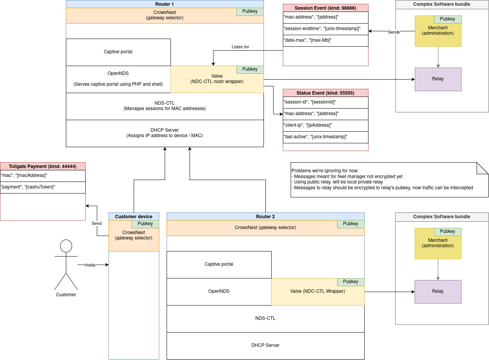
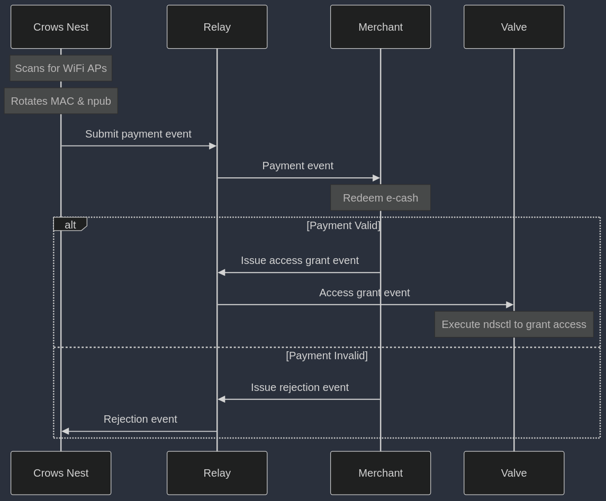

##  What is a TollGate?
TollGate is a set of tools that enables WiFi routers to accept Bitcoin payments for internet access. This allows anyone with suitable hardware and an internet gateway to operate as an internet service provider.

## What is nostr?
[Nostr](https://github.com/nostr-protocol/nips/blob/master/01.md) (Notes and Other Stuff Transmitted by Relays) is a simple yet powerful decentralised protocol that enables seamless JSON based communication between public keys through relay servers. In the context of TollGate, nostr serves as the perfect foundation for handling WiFi access payments by eliminating the need for traditional captive portals and providing instant, reliable connections through websocket technology. The protocol's relay-based architecture reduces common firewall issues while offering standardised payment methods. Its flexible nature means components can be deployed almost anywhere with minimal configuration, making it ideal for TollGate operators to set up and developers to maintain their services.

### What are the hardware requirements?
A TollGate must have at least two TCP/IP interfaces. One interface connects to an internet gateway, while the other interface acts as a WiFi access point for users or other TollGates. Each TollGate runs its own DHCP server with a unique address range to avoid collisions with its gateway or its clients - who could also be running a DHCP server. Hence, each TollGate is a stand-alone system from a networking perspective. Finally, each TollGate has gate-keeping logic that manages firewall rules for allowing clients to access the internet gateway once they have paid and to cut them off again when their session ends.

Currently we are targeting [GL-AR300m](https://www.gl-inet.com/products/gl-ar300m/), [GL-MT300](https://www.gl-inet.com/products/gl-mt3000/?utm_source=website&utm_medium=menubar) and [GL-MT600](https://www.gl-inet.com/products/gl-mt6000/) because they come with uboot and they support OpenWRT out of the box.

### TollGate's New Architecture
Previously we used WiFi captive portals like [nodogsplash](https://github.com/nodogsplash/nodogsplash) and [OpenNDS](https://github.com/openNDS/openNDS) for managing access to the internet gateway. These captive portals allowed us to quickly build a proof of concept. However, both captive portals came with severe UX and maintainability limitations - see [limitations of captive portals](#benefits-of-using-crows-nest-over-captive-portal).

A key benefit of building on `nostr` is that `services` can generate their own public key based identity (`npub`) in order to send and receive `json` content from other services as long as they have an outbound internet connection that can connect to public IP addresses. Nostr abstracts away the networking layer entirely, so developers don't need to think about things like firewalls, IP-addresses, ports and network boundaries.

Thanks recent success that @origami74 had in running a nostr [relay](https://github.com/fiatjaf/khatru) and a [client](https://github.com/OpenTollGate/tollgate-module-valve-go) on the GL-AR300m, we are now able to build in ways that we could only have dreamt of before. 

This figure illustrates the modules that TollGate is now comprised of:

And this sequence diagram illustrates the interaction between the services:

TollGate is now comprised of three main types of services and a relay:

* **Crows Nest:** scans for available WiFi access points in search of gateways that are worth connecting to. Upon finding a suitable gateway, the crows nest rotates this devices `MAC address` and `npub` (for privacy), connects to the WiFi access point and submits a `payment event` if required.
* **Valve:** manages access to the internet gateway. Currently the valve is just a `nostr` wrapper around a CLI tool for managing user sessions in captive portals called [ndsctl](https://opennds.readthedocs.io/en/stable/ndsctl.html). Thanks to the fact that the valve now has an `npub`, it can be controlled via events that are issued by the `merchant` service.
* **Merchant:** sets prices, redeems e-cash notes from `payment events` that customers issued and it issues events that the valve responds to. Merchants can be light weight and fit on the router if they outsource the e-cash redemption logic to third party APIs. However, thanks to nostr, the merchants don't need to run on the router.
* **Relay:** simplifies connectivity for services. Nostr relays usually have a public IP address, though TollGates will also have a local relay so that critical services that are in the local network continue to function when the TollGate loses internet access.

### What runs where?
Now that merchants are controlling `valves` via nostr events, it is perfectly fine for the merchant to be a more complex software bundle with an e-cash wallet and lightning support on an `x86 machine`. The merchant can just issue `nostr events` that control the valve irrespective of how the network connecting the `x86 machine` with the `router` looks. Having the ability to shuffle services around between devices like this enables TollGate contributors to create value with the skill sets that they already have more easily.
#### Reasoning for order in which devices are being targeted
The following table provides an overview of the order in which we hope to target various devices for each of TollGate's services:

| Module          | Low hanging fruits | Mid term targets | Long term targets |
| --------------- | ------------------ | ---------------- | ----------------- |
| Crows Nest      | Router, Mobile     | x86, armhf       | IoT               |
| Valve           | Router             | x86, armhf       | mobile            |
| Full Merchant   | x86, armhf         | router           | mobile            |
| Legacy Merchant | router             | -                | -                 |

##### Crows Nest
Routers need the ability to buy from other routers so that the network can grow outwards from the gateway. Hence, routers need a crows nest for TollGate based networks to scale. Fortunately we already know how to work with OpenWRT routers, so this is becoming a well trodden path. Previously, users interacted with the WiFi captive portals manually and they still can if they like, but it isn't recommended (see section [crows nest vs captive portal](#benefits-of-using-crows-nest-over-captive-portal)). 

Users who own a TollGate can have the WiFi UX that they are already used to because they can connect to their own device using a WiFi password like they already do with their home router. They are not making any compromises since they are authenticating their devices on their own TollGate. The crows nest of their TollGate now purchases internet on their behalf and without their device needing to know anything about TollGate.

Requiring that users own a router to get the full TollGate experience could hinder adoption. Sure, they can paste e-cash into the captive portal manually or with a script, but the UX depends on their client device and they have all the down sides of not making granular payments.  Hence, users who want good UX without owning a TollGate would benefit from having a crows nest on their client devices (`mobile` and `x86`) for more granular and reliable data purchases.
##### Valve
Each TollGate needs to have a valve in order to manage access to the internet gateway. The valve must run on the router since that's currently our gate-keeping device. However, ndsctl seems to already have [debian support](https://manpages.debian.org/testing/opennds-daemon-common/ndsctl.1.en.html) so running a TollGate on an `x86` or `armhf` machine might just be a question of getting the network interfaces and configurations under control on debian. 

> [!NOTE]
> Currently there isn't a clear line between ndsctl (which we rely on for gate-keeping) and the captive portal which brings a lot of complexity to TollGate. Hopefully the valve becomes more of a stand alone solution rather than a wrapper around part of a captive portal in future (see section [captive portal](#benefits-of-using-crows-nest-over-captive-portal)).

##### Merchants
##### Legacy Merchant
The "legacy merchant" is what we have been using so far. Its just a shell script that runs on the router and submits incoming e-cash notes to a 3rd party API that redeems the notes over lightning and returns a HTTP response informing the TollGate whether the payment was redeemed successfully. This worked since day 1 of TollGate thanks to the robust and accessible cashu ecosystem and the fact that no cryptographic libraries or wallets need to run on the router. However, it meant that TollGate's feature set depended on the APIs of other projects whose developers were also busy.
##### Full Merchant
Now that TollGate has full nostr support, operators can easily run their own e-cash wallet, lightning node and gateway selection business logic on an x86 machine and continue to interact with other components of TollGate as if this complex software bundle was running on the router. Clearly this model is more self sovereign and a faster route to building robust TollGates. We can still work on moving the merchant onto the router for more powerful routers or for `x86/armhf` based TollGates.

#### Build process & reproducability

#### Benefits of using crows nest over captive portal
* **Granularity:** 
* **Control over UX:**
* **Interoperability:**

Captive portals can still be useful to new users who neither have a TollGate nor a crows nest on their devices. However, in its current form this isn't a solution that we are proud of, so we would like to make sure that TollGate doesn't depend on it. 

- Slow Development cycle (recompiling) and limited use of available tooling
- Shell scripts not scalable
- ... - **@chandran** add stuff here...
- Signer client
